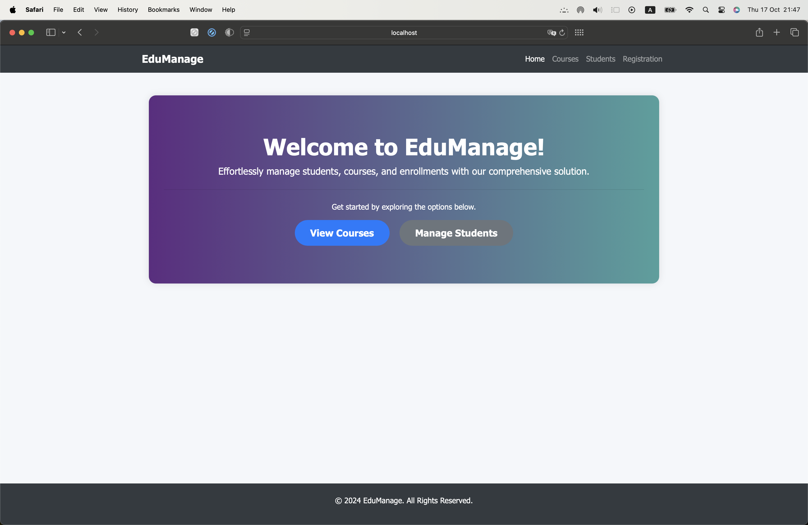
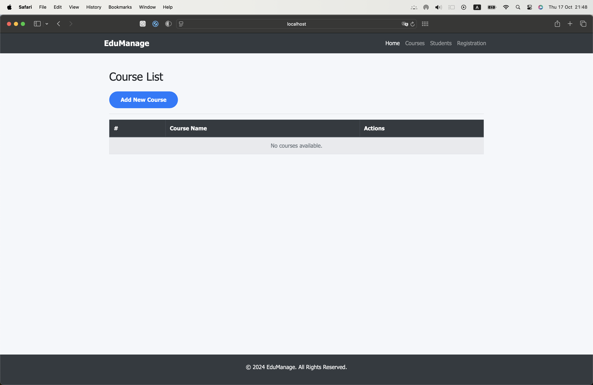
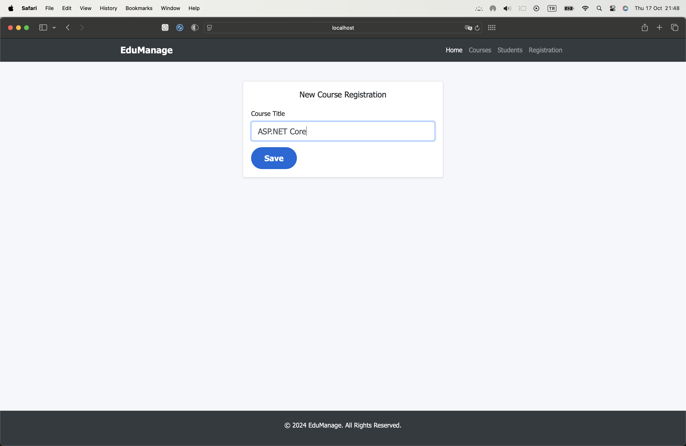
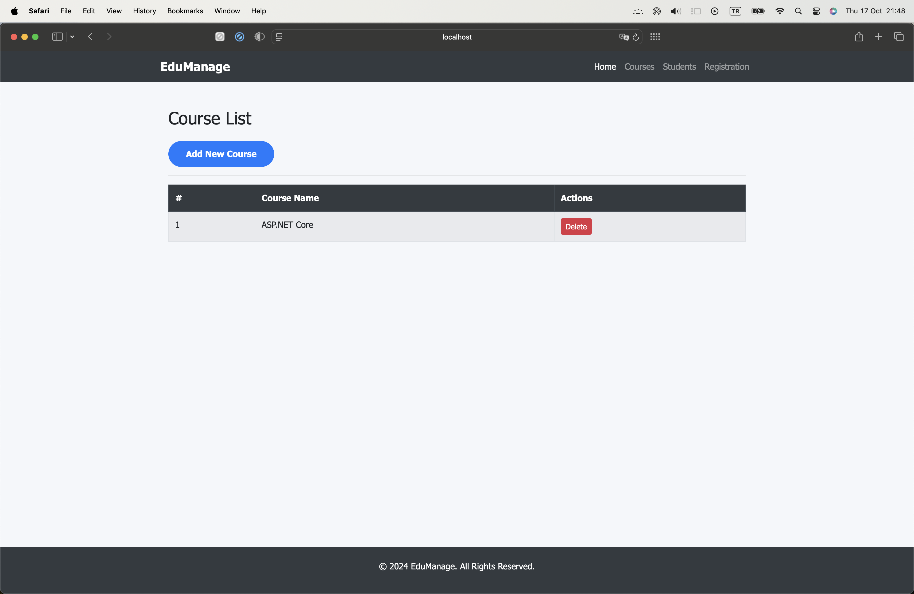
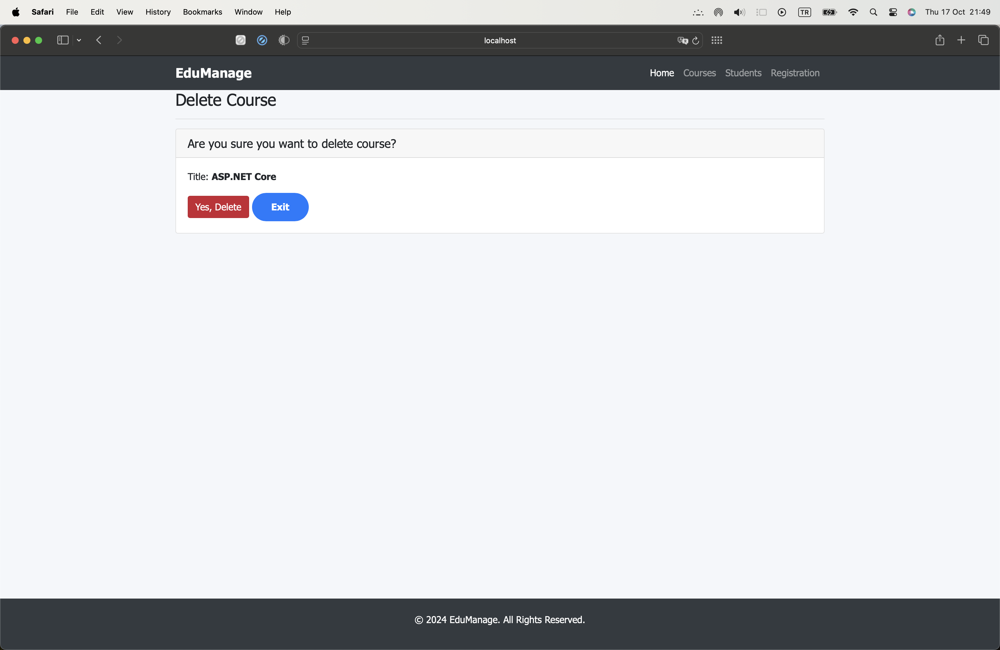
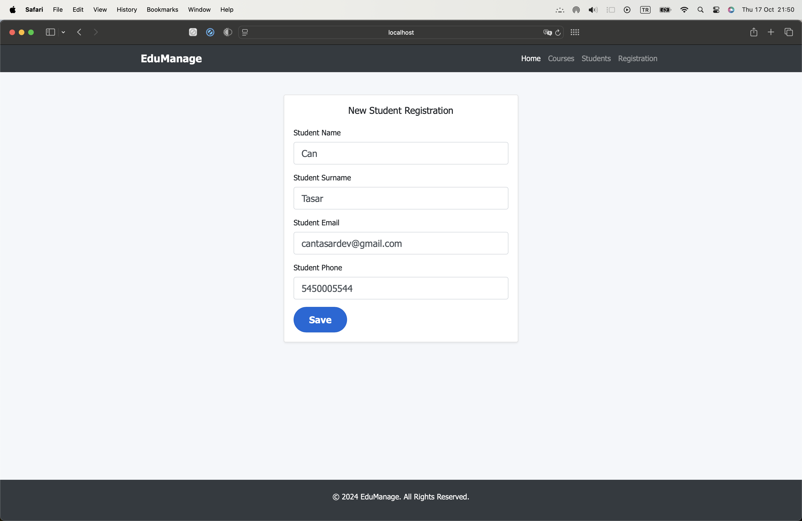
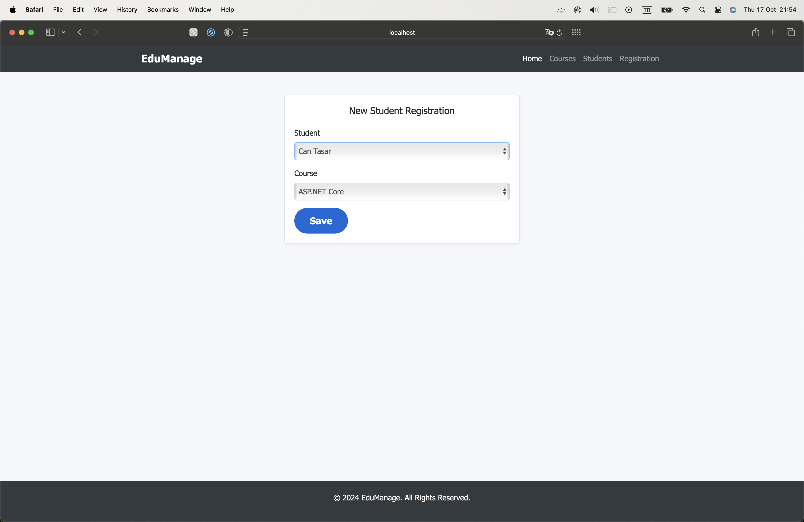
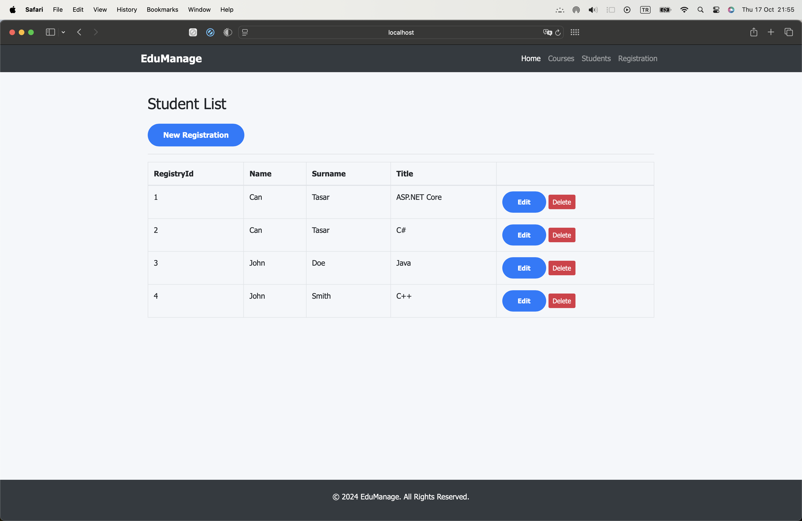
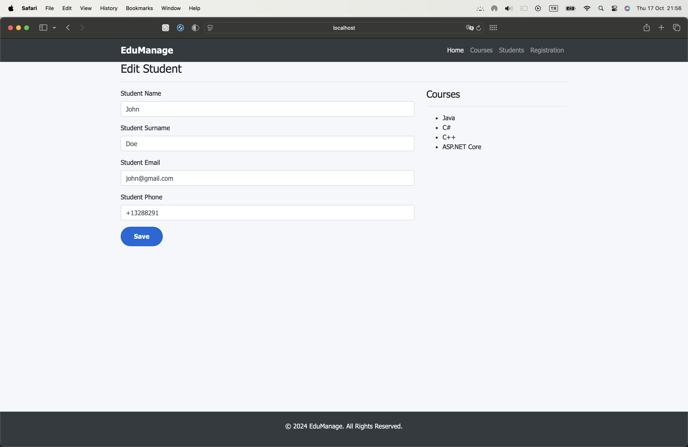

# EduManage

EduManage is a backend solution designed to streamline the management of student records, courses, and enrollment processes. Built with modern web technologies, it ensures efficient data handling and scalability for educational institutions.

## Features

- **Student Management**: Manage student profiles, including personal details, academic records, and enrollment history.
- **Course Management**: Create, update, and manage course information, including schedules, descriptions, and credits.
- **Enrollment System**: Handle student course registrations, track enrollment status, and manage academic schedules.

## Technologies Used

- **ASP.NET Core 8.0**: For building a robust and scalable web backend.
- **Entity Framework Core 8.0**: To manage database operations with Code First approach.
- **SQLite**: A lightweight and portable database solution.
- **MVC Architecture**: To ensure separation of concerns and maintainable code structure.
- **Code First Migrations**: Enable seamless database versioning and updates.

## Installation

1. Clone the repository:
    ```bash
    git clone https://github.com/cantasar/EduManage.git
    ```
2. Navigate to the project directory:
    ```bash
    cd EduManage
    ```
3. Restore dependencies:
    ```bash
    dotnet restore
    ```
4. Apply migrations to set up the database:
    ```bash
    dotnet ef database update
    ```
5. Run the project:
    ```bash
    dotnet run
    ```

## Project Structure

- `/Controllers`: Handles requests and responses for different resources (students, courses, enrollment).
- `/Models`: Defines the data structures and relationships for the application.
- `/Views`: (If applicable) Provides the user interface templates.
- `/Migrations`: Stores the Code First migration scripts.
- `/Data`: Contains database context and configurations.

## Screenshots

To provide a better understanding of the functionalities and user interface, here are some screenshots from the EduManage project:

- **Home Page**

  The main index page that provides an overview of the EduManage application, allowing users to navigate through different sections, such as student management, course management, and enrollment.

  

- **Course List Page**

  Displays a list of all available courses. The page includes details like course name, description, and credit hours, with options to view, edit, or delete each course.

  

- **New Course Registration Page**

  Allows users to add a new course to the system. The form requires input fields such as course name, description, and credit hours. Submitting the form will create a new entry in the database using a POST operation.

  

- **Updated Course List Page**

  Shows the course list after a new course has been added or an existing course has been updated. The list reflects real-time changes in the database.

  

- **Delete Course Page**

  Provides a confirmation dialog for deleting a course. Upon confirmation, the selected course is removed from the database, ensuring that it no longer appears in the course list.

  

- **New Student Registration Page**

  Users can register a new student by filling out the form with personal details. Once submitted, the data is saved to the student database via a POST operation, thanks to migrations and entity models.

  

- **Enroll Student to Course Page**

  Allows users to enroll a student in a specific course. Users can select a student and then choose a course from the available list. This action creates a record in the enrollment database.

  

- **Students Enrolled in Courses List Page**

  Displays a list of students who have registered for various courses. Each entry shows the student's name and the courses they are enrolled in, along with options to update or remove enrollments.

  

- **Student Details Page**

  Shows detailed information about a specific student, including personal details and the list of courses they are enrolled in. Users can update the student's details and see their enrollment status.

  

## Contributing

Feel free to contribute by submitting pull requests, reporting issues, or suggesting new features.

---
